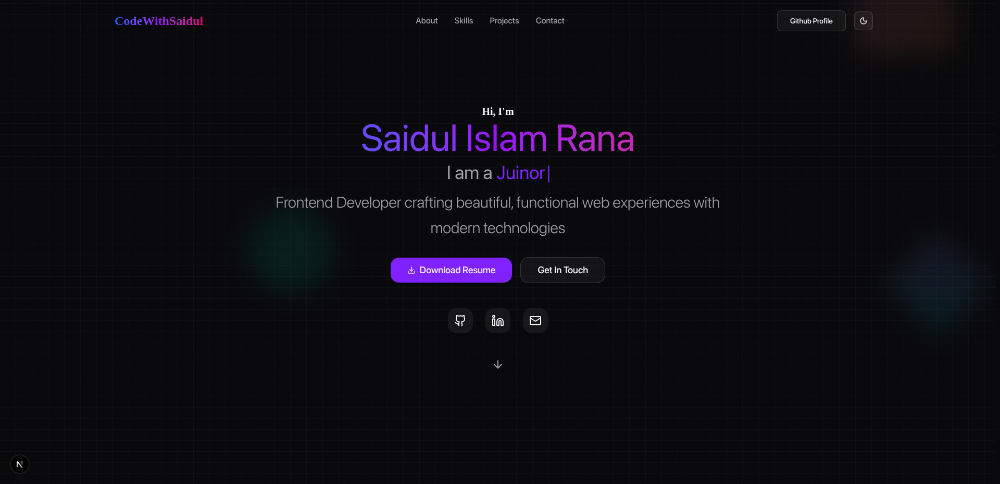

# My Personal Portfolio

This repository contains the source code for my personal portfolio website, designed to showcase my skills, projects, and journey as a full-stack web developer. It is built with a focus on modern web technologies, performance, and a clean, responsive user experience.

**Live Site URL:** [**https://codewithsaidul.vercel.app**](https://codewithsaidul.vercel.app)

---

## ✨ Features & Architectural Highlights

This portfolio is more than just a static site; it's a demonstration of modern frontend architecture and best practices.

* **Modular & Section-Based Architecture:** The entire UI is built using reusable components and organized into logical sections (`Hero`, `About`, `Projects`, etc.) for clean separation of concerns and easy maintenance.
* **Performance Optimized:** Built with Next.js for server-side rendering (SSR) and static site generation (SSG), ensuring fast initial page loads.
* **Smooth Scrolling Experience:** Implemented a smooth, high-performance scrolling experience using `react-lenis`.
* **Engaging Animations:** Utilizes custom providers and hooks to manage animations, creating a dynamic and engaging user experience.
* **Type-Safe Codebase:** Fully written in TypeScript to ensure code quality, maintainability, and a better developer experience.
* **SEO Friendly:** Includes a dynamically generated `sitemap.xml` and `robots.txt` for better search engine visibility.

---

## 🛠️ Technology Stack

| Category | Technology |
| :--- | :--- |
| **Framework** | Next.js |
| **Language** | TypeScript |
| **Styling** | Tailwind CSS, shadcn/ui |
| **Animation & Scrolling** | GSAP, React Lenis |
| **Deployment** | Vercel |

---
## 🧑‍💻 Connect with me

Thank you for visiting my portfolio's repository. Feel free to connect with me!

* **GitHub:** `[@codewithsaidul](https://github.com/codewithsaidul)`
* **LinkedIn:** `[@codewithsaidul](https://linkedin.com/in/codewithsaidul)`